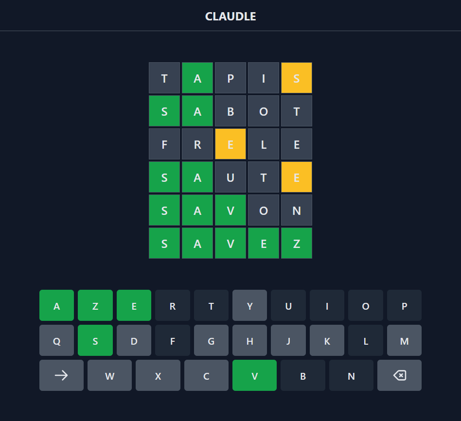

# Claudle

Claudle est un jeu inspiré du jeu [Wordle](https://www.nytimes.com/games/wordle/index.html) dans le cadre du PPII2.
Il a été réalisé par :

- BENÉ Tom
- LI Alexandre
- NOIRAY MOUSSU Camille
- RICARD Guillaume

## Documentation

- [Claudle](#claudle)
  - [Documentation](#documentation)
  - [Prérequis](#prérequis)
  - [Claudle - le jeu](#claudle---le-jeu)
    - [Installation du jeu](#installation-du-jeu)
    - [Utilisation](#utilisation)
      - [Lancer le jeu](#lancer-le-jeu)
      - [Comment jouer?](#comment-jouer)
  - [Le solveur](#le-solveur)
    - [Installation](#installation)
    - [Utilisation](#utilisation-1)
  - [Documentation](#documentation-1)

## Prérequis

Pour jouer:
- Linux ou MacOS
- Python 3.8 ou supérieur
- nodejs 17.0.0 ou supérieur
  
Pour utiliser le solveur:
- C99

## Claudle - le jeu

### Installation du jeu

Pour installer les **dépendances**, rendez vous dans le dossier `game`, puis exécuter le script `setup.sh` dans un terminal.

### Utilisation

#### Lancer le jeu

Placez vous dans le dossier `game`, puis executez le script `launch.sh` dans un terminal pour lancer le jeu.

#### Comment jouer?

Devinez le mot en un nombre **limité** d'essais !

Chaque essai doit être avec un mot **valide**.
Après chaque essai, les lettres seront colorées selon leur présence dans le mot.
**Vert** correspond à une lettre au **bon endroit**, **Jaune** à une lettre **présente** dans le mot mais pas au bon endroit et **Gris** à une lettre **inexistante** dans le mot.

## Le solveur

Le solveur est un programme implémenté en C, elle permet au joueur de proposé le mot le plus efficace pour gagné au Wordle. Pour cela, le solveur calcul l'entropie de chaque mot dans le dictionnaire.

### Installation

Pour pouvoir utiliser le solveur, vous devez d'abord compiler le programme.Pour cela, placez vous dans le dossier `solver` et compilez en saisissant `make install` dans un terminal.

### Utilisation

Pour lancer le programme, `make run`.

Le programme proposera un mot que vous devriez saisir dans le Wordle/Claudle. Ensuite, il vous est demandé de saisir le "score" du mot:

- 2 pour une lettre colorée **Verte**
- 1 pour une lettre colorée **Jaune**
- 0 pour une lettre colorée **Grise**

Cela jusqu'à ce qu'on gagne le jeu.

> Par exemple:
>
> 
> 
> La saisie ici est: 22001
  
Pour quittez le programme, vous pouvez simplement saisir `-1`.

## Documentation

Pour plus d'information, visitez la page [nodejs](https://nodejs.org/en/).

Théorie de l'information et entropie pour le Wordle: [Solving Wordle using information theory](https://www.youtube.com/watch?v=v68zYyaEmEA)